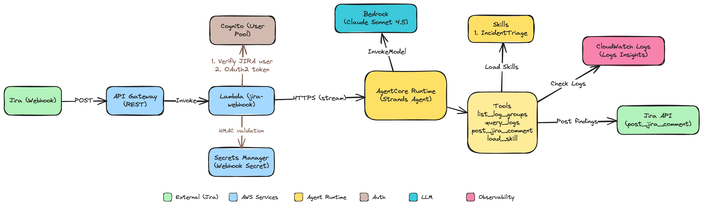

# SRE Agent

An AI-powered SRE agent that receives Jira alerts, investigates CloudWatch logs across services, and posts findings back to the originating ticket.

## Architecture



## Project Structure

```
.
├── app.py                        # CDK application entry point
├── pyproject.toml                # Python project dependencies
├── Makefile                      # Main Makefile (includes sub-makefiles)
│
├── makefiles/                    # Modular Makefile organisation
│   ├── setup.mk                  # Setup and installation commands
│   ├── config.mk                 # Configuration validation
│   ├── code-quality.mk           # Linting and formatting
│   ├── cdk.mk                    # CDK deployment commands
│   ├── users.mk                  # Cognito user management (create, list)
│   ├── manual-tests.mk           # Manual testing scripts
│   ├── scenarios.mk              # Test scenario injection and cleanup
│   └── convenience.mk            # Convenience targets
│
├── config/                       # Environment-specific configurations
│   └── dev.yaml                  # Development environment settings
│
├── src/
│   ├── cdk/                      # CDK infrastructure code
│   │   ├── config.py             # Configuration loader (type-safe YAML parsing)
│   │   ├── stack.py              # Main SRE Agent stack
│   │   ├── constructs/           # Reusable L3 constructs
│   │   │   ├── cognito.py        # Cognito user pools and app clients
│   │   │   ├── runtime.py        # AgentCore Runtime
│   │   │   └── docker_lambda.py  # Docker Lambda with named ECR repository
│   │   └── utils/                # Utility functions
│   │       ├── cleanup.py        # Log group cleanup aspects
│   │       └── strings.py        # Case conversion utilities
│   │
│   ├── common/                   # Shared utilities
│   │   └── logger.py             # Structured logging module
│   │
│   ├── agent/                    # Agent runtime implementation
│   │   ├── main.py               # Entry point and orchestration
│   │   ├── config.py             # Configuration management
│   │   ├── agent_handler.py      # Core agent invocation logic
│   │   ├── pyproject.toml        # Agent dependencies
│   │   ├── Dockerfile            # Agent container image
│   │   ├── prompts/              # System prompt management
│   │   │   ├── system_prompt.md  # Base system prompt
│   │   │   └── loader.py         # Load and compose system prompts
│   │   ├── hooks/                # Agent lifecycle hooks
│   │   │   └── token_usage_tracker.py  # Per-cycle token usage and cost tracking
│   │   ├── skills/               # Skill definitions (markdown)
│   │   │   ├── loader.py         # Extract skill summaries for system prompt
│   │   │   └── incident_triage.md        # Investigate logs, identify root cause, post findings
│   │   └── tools/                # Agent tools
│   │       ├── __init__.py
│   │       ├── skills.py         # load_skill - retrieve full skill instructions
│   │       ├── cloudwatch.py     # list_log_groups, query_logs
│   │       └── jira.py           # post_jira_comment
│   │
│   └── jira_webhook/             # Jira webhook Lambda
│       ├── main.py               # Validate signature, verify user, call AgentCore
│       ├── requirements.txt      # Lambda dependencies
│       └── Dockerfile            # Lambda container image
│
├── scripts/                      # Utility scripts
│   ├── create_user.py            # Create Cognito user for agent authentication
│   └── list_users.py             # List all users in Cognito User Pool
│
└── tests/
    ├── common/
    │   └── auth/
    │       └── cognito_user.py   # Cognito user validation
    ├── manual/
    │   └── runtimes/
    │       └── agent/            # Agent runtime testing
    │           ├── invoke_agent.py   # Invoke agent with OAuth2 authentication
    │           ├── hello.py          # Send a hello message
    │           └── chat_client.py    # Interactive chat client
    └── scenarios/
        └── slow_db_queries/      # Scenario 1: slow DB queries causing app slowness
            ├── logs/             # Synthetic log data (JSONL per service)
            ├── inject.py         # Push logs into CloudWatch and update jira.md timestamp
            ├── cleanup.py        # Delete injected CloudWatch log groups
            ├── scenario.md       # Scenario description and infrastructure overview
            ├── jira.md           # Sample Jira alert for this scenario
            └── triage_results/   # Human vs Agent triage analysis
                ├── agent.py      # Actual agent run logs with token usage
                ├── human.py      # Step-by-step human SRE triage walkthrough
                └── comparison.md # Cost and time comparison (human vs agent)
```

## Prerequisites

- Python 3.12 or higher
- AWS CLI configured with appropriate credentials and an active session
  ```bash
  aws sts get-caller-identity
  ```
- AWS CDK CLI installed (`npm install -g aws-cdk`)
- AWS account bootstrapped for CDK
  ```bash
  cdk bootstrap aws://AWS_ACCOUNT_ID/REGION_NAME --context env=dev
  ```

## Quick Start

### 1. Configure Environment

Copy and edit the environment file:

```bash
cp .env.example .env
```

Set the following in `.env`:
- `REGION_NAME` - AWS region (e.g. `ap-southeast-2`)
- `ENV` - Deployment environment (`dev`, `prod`)
- `ACTOR_ID` - Jira username for Cognito user creation
- `USER_DOMAIN` - Jira email domain for Cognito users

### 2. Install Dependencies

```bash
make install
```

### 3. Deploy Infrastructure

```bash
make deploy
```

### 4. Configure Jira

**Generate a webhook shared secret:**
```bash
python3 -c "import secrets; print(secrets.token_hex(32))"
```

**Generate a Jira API token**: go to `id.atlassian.net → Account Settings → Security → API tokens → Create API token`.

**Get the webhook URL** (after deploy):
```bash
aws ssm get-parameter \
  --name "/sre-agent-stack-dev/jira-webhook-url" \
  --query "Parameter.Value" --output text
```

In Jira: **Settings → System → Webhooks → Create a Webhook** - set the URL above, the shared secret, and select the Issue: created event for the agent to handle.

### 5. Update Secrets Manager

Store the values from step 4:

**Jira webhook secret** - for HMAC-SHA256 signature validation:
```bash
aws secretsmanager put-secret-value \
  --secret-id "sre-agent-stack-dev/jira-webhook-secret" \
  --secret-string "<your-jira-webhook-secret>"
```

**Jira API secret** - for the agent to post comments:
```bash
aws secretsmanager put-secret-value \
  --secret-id "sre-agent-stack-dev/jira-api" \
  --secret-string '{"base_url": "https://<your-domain>.atlassian.net", "api_token": "<your-api-token>"}'
```

### 6. Create Cognito User and Test the Agent

Create a Cognito user for the Jira user who will trigger the webhook. The email must match the Jira account email - the Lambda verifies the triggering user exists in Cognito before forwarding to the agent.

Set `ACTOR_ID` in `.env` to the Jira user's email prefix and `USER_DOMAIN` to their email domain, then:

```bash
make create-user
make agent-hello
make agent-chat
```

## Test Scenarios

Inject synthetic CloudWatch logs to test the agent end-to-end:

```bash
# Scenario 1 - Slow DB queries causing app slowness
make scenario-1-inject   # clean previous logs then push fresh logs into CloudWatch
make scenario-1-clean    # delete log groups after testing
```

> **Note:** After injecting, wait ~1 minutes before creating the Jira ticket. The inject script automatically updates the `Triggered` timestamp in `jira.md` to the current UTC time. Logs are available for 60 minutes after inject.

Then create a Jira ticket using the template in `tests/scenarios/slow_db_queries/jira.md` and watch the agent investigate and comment its findings.

Results from a real run: the agent diagnosed a missing database index (root cause of a CPU spike in api server) in **51 seconds using 7 tool calls for $0.15** - see the [full cost and time comparison](tests/scenarios/slow_db_queries/triage_results/comparison.md).

## Available Commands

```bash
make help
```

## Cleanup

```bash
make destroy
```
